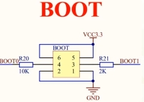

---
next:
  text: "Markdown"
  link: "/guide/markdown"
---

# STM32 最小系统构成

了解最小系统构成可以帮助我们更好的理解 STM32 的工作原理，在 diy 时也可以作为参考。

## 晶振电路

### 晶振电路提供给单片机工作所需要的时钟

#### 通常不使用单片机内部晶振，使用外部晶振，一般选择 8MHz

直接将晶振接入会出现系统工作不稳定的情况，因为晶振会产生一些电感，所以会在晶振两端分别接入电容，电容选择无极性的。一端接晶振一端接地。

选取的电容大小通常取决于晶振频率大小，通常选 10~33pF，这里选用的是 22pF。

通常还会在 8M 晶振旁并联一个 1M 的电阻

> 图中 VBAT 接入了 3.3V 电源，当电源没有供电时，由 D2 供电,BAT1 是纽扣电池，前面接二极管是为了让 D1 没电时才给 VBAT 供电，以免浪费纽扣电池的里的电

> 图中红色方框框起来的 **"OSC_IN"和"OSC_OUT"** 被称为**网络标号**，说明下面的这个晶振电路图中的 **"OSC_IN"和"OSC_OUT"** 分别和 **23、24**是相连的

#### 这里还使用了一个 32.768K 的晶振供给 RTC 时钟

## 复位电路

复位电路实现系统重启
STM32 的复位引脚为 **NRST** 它是低电平触发，也就是说当
**NRST** 引脚为低电平时，复位电路被触发，系统会复位

### 该电路有两种触法方式

- 按下 **RST** 键
- 通过 **RC 电路** 的充放电

## 电源电路

STM32工作电压为 `1.8v~3.3v` ，通常我们使用的是直流3.3v

### 火牛接口

`DC_IN` 电源输入，输入为 `5v`，通过稳压芯片 `1117-3.3` 将 `5v` 输入转为 `3.3v`  

`D3[电流指示灯]`  

`J3` `J4` 为预留的端子，方便后续外接模块供电

`J3` 为 `5v` `J4` 为 `3.3v`

### USB接口

`VBUS` 本身就有 `5v` 供电，直接接在 `VCC` 上 

usb转串口芯片 `CH340` 也会用到（右半部分）

## 下载电路

### USB USART（串口）

现在的笔记本没有 `RS232` 芯片 所以需要 `CH340` usb转串口芯片

这块板子使用的是 `CH340-C` 内部自带晶振 使用相对方便

这块板子相当于将 `USB2` 的 `D-` 和 `D+` 信号转换后通过 `TXD` 和 `RXD` 接在了端子 `P4` 上，然后再接在`STM32` 上

使用端子而不是直接接是因为想通过串口外接模块方便调试，例如wifi模块、蓝牙模块、GPS模块

`P4` 中 `1` 和`2` 短接，  `3` 和`4` 短接

### JTAG仿真器

>  这样接就是标准接法 没啥好说的

## 启动模式

|   BOOT1   | BOOT0 |   启动模式   | 说明                       |
| :-------: | :---: | :----------: | -------------------------- |
| X（1or0） |   0   | 主闪存存储器 | 主闪存存储器被选为启动区域 |
|     0     |   1   |  系统存储器  | 系统存储器被选为启动区域   |
|     1     |   1   |   内置SRAM   | 内置SRAM被选为启动区域     |

需要对 `STM32` 进行程序下载时进入 `系统存储器` 模式

需要 `STM32` 进入运行模式是就要进进入 `主闪存存储器` 模式

~~`SRAM` 模式用于调试，一般不使用，flash足以~~

`BOOT0` 通过上位机软件控制，具体看图 `USB USART`

