# 使用寄存器点亮第一个 LED

## STM32 GPIO 介绍

### GPIO 概念

GPIO 引脚分类

- 电源引脚
- 晶振引脚
- 复位引脚
- 下载引脚
- BOOT 引脚
- GPIO 引脚

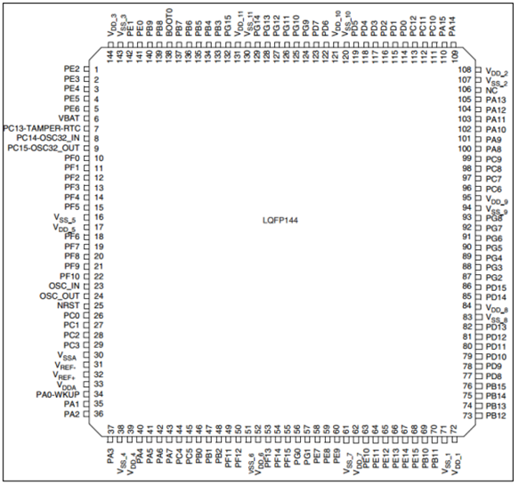

#### 电源引脚

`VDD` `VSS` 等等这一类的引脚

#### 晶振引脚

在[stm32 最小系统](./stm32最小系统)中有讲

#### 下载引脚

同上

#### BOOT 引脚

同上

#### GPIO 引脚

除了上面的都是，电源引脚、复位引脚、不能当作 GPIO 用，别的引脚也许可以，具体要查芯片手册

### GPIO 引脚功能

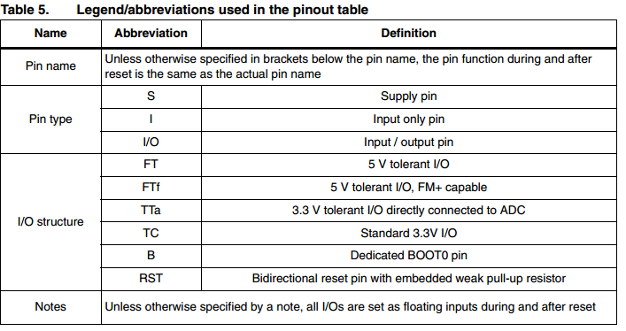

#### GPIO 结构框图

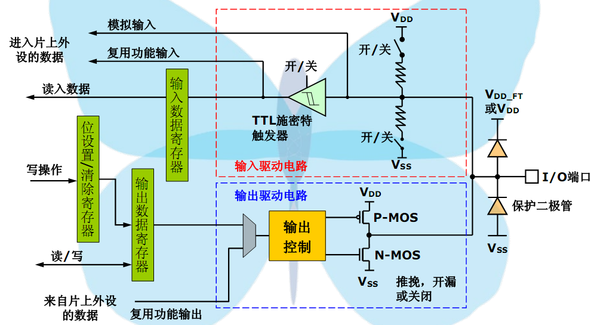

推挽模式可以使负载能力和开关速度都大大提高，这是由 mos 管性能所决定的

#### GPIO 工作模式

**输入模式**

- 输入浮空

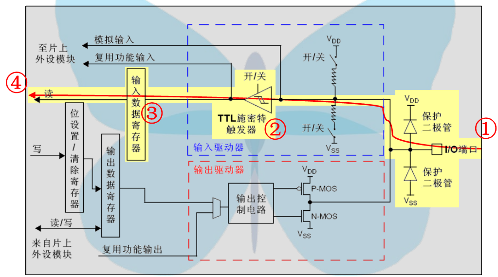

- 输入上拉

  > 该模式对比输入浮空模式仅仅使能上拉电阻

  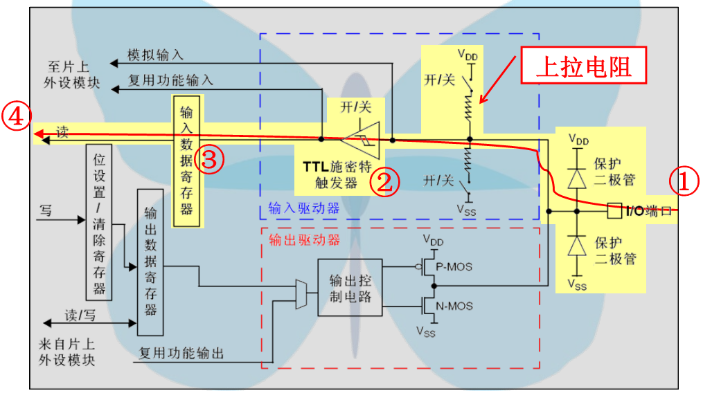

- 输入下拉

  > 对比该模式对比输入浮空模式仅仅使能下拉电阻

  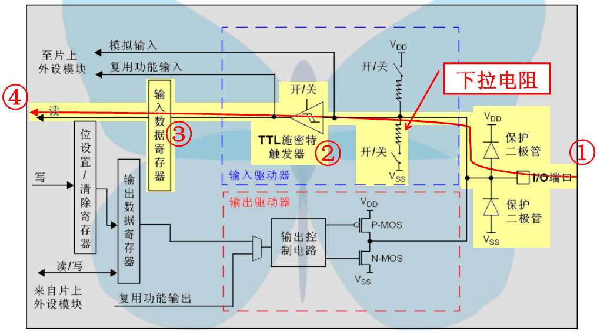

- 模拟输入

  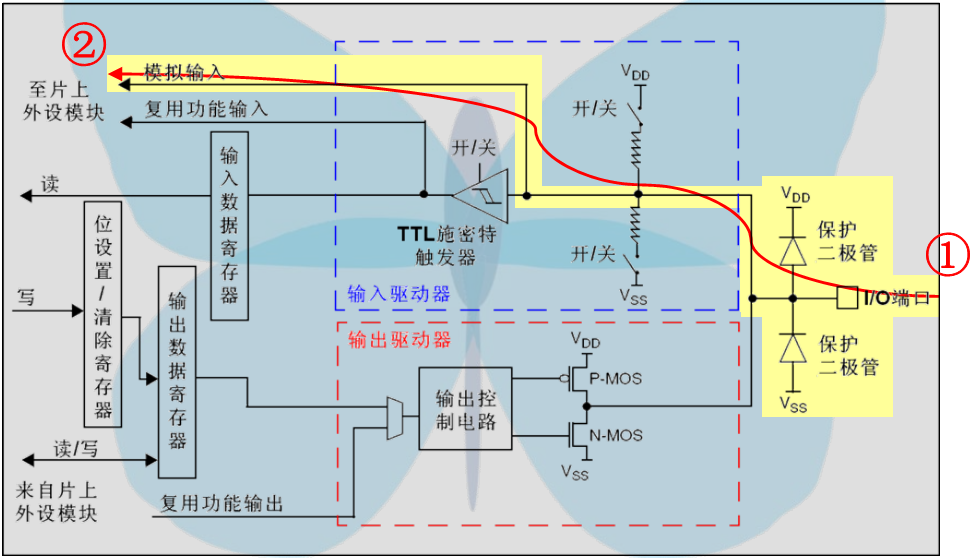

**输出模式**

> 和输入模式不一样的是，它既可以写也可以读

- 开漏输出

  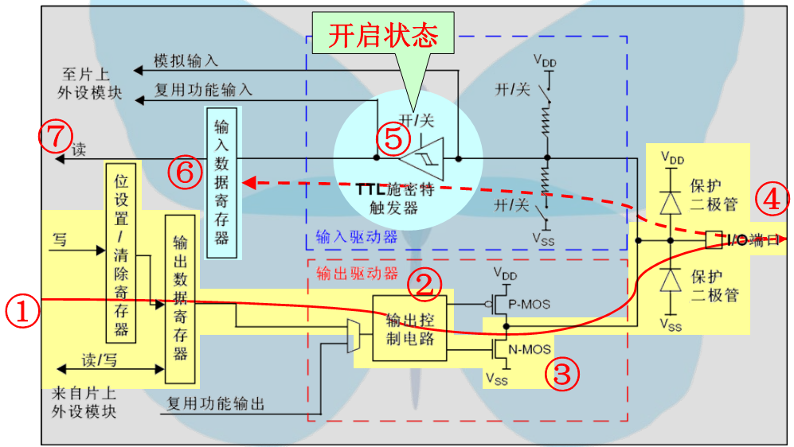

- 开漏复用功能

  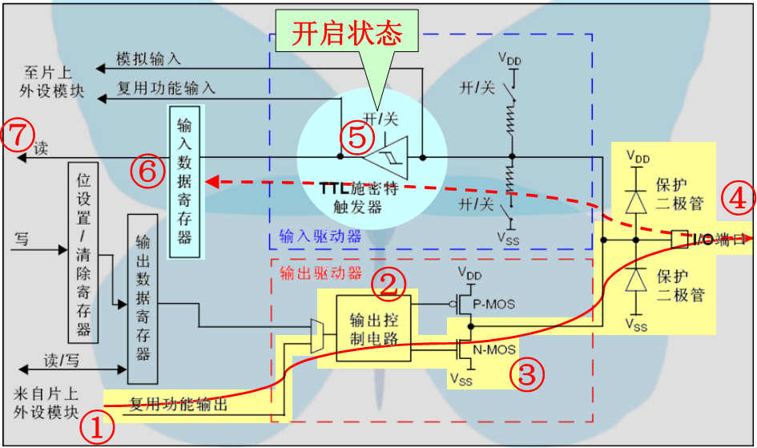

- 推挽式输出

  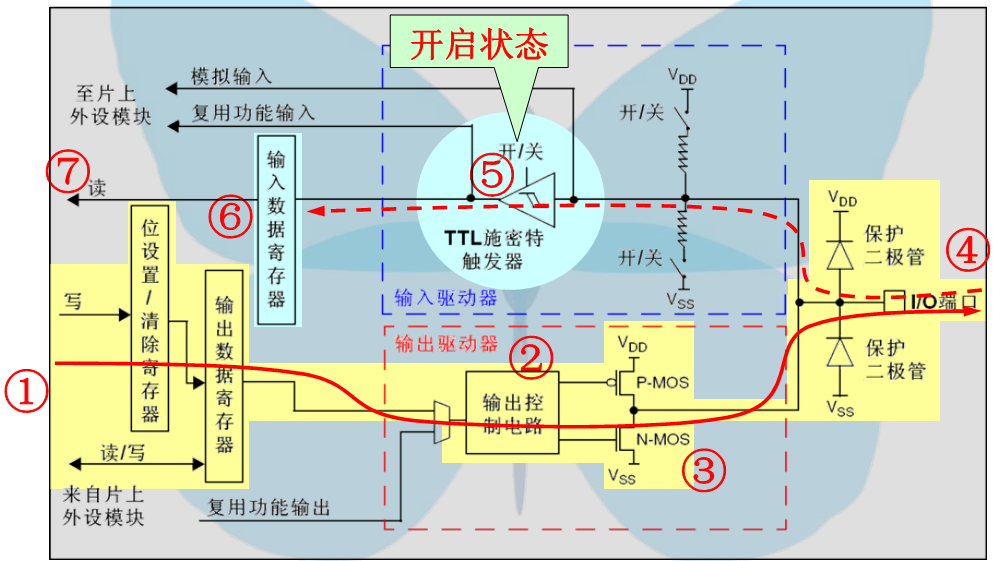

- 推挽式复用功能

  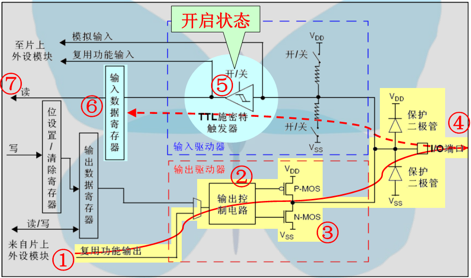

## 硬件设计

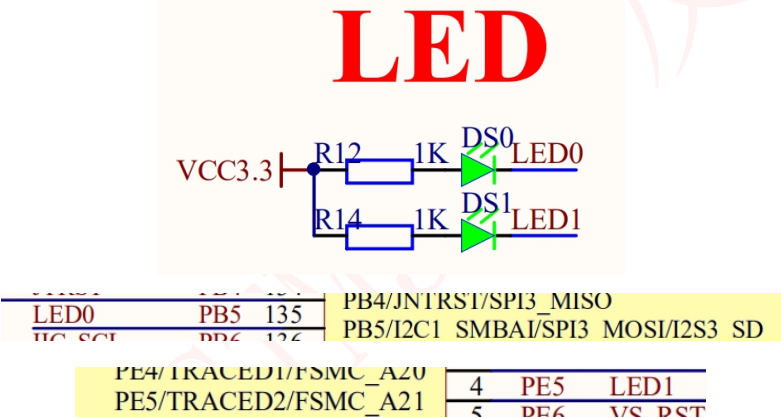

## 软件设计

**main.c**

```c
#include "stm32f10x.h"

typedef unsigned int u32;   //类型重定义 unsigned int -- u32


void SystemInit(void)
{

}

void delay(u32 i)
{
	while(i--);
}

int main()
{
	RCC_APB2ENR |= 1<<3;
	GPIOB_CRL &= ~( 0x0F<< (4*5));
	GPIOB_CRL |= (3<<4*5);
	GPIOB_BSRR=(1<<(16+5));
	while(1)
	{
		GPIOB_BSRR=(1<<(16+5));
		delay(0xFFFFF);
		GPIOB_BSRR=(1<<(5));
		delay(0xFFFFF);
	}
}
```

**stm32f10x.h**

```c
#define PERIPH_BASE      ((unsigned int)0x40000000)
	
#define APB2PERIPH_BASE  (PERIPH_BASE + 0x00010000)

#define GPIOB_BASE       (APB2PERIPH_BASE + 0x0C00)

#define GPIOB_CRL 	 	 *(unsigned int*)(GPIOB_BASE+0x00)
#define GPIOB_CRH 	 	 *(unsigned int*)(GPIOB_BASE+0x04)
#define GPIOB_IDR 	 	 *(unsigned int*)(GPIOB_BASE+0x08)
#define GPIOB_ODR 	 	 *(unsigned int*)(GPIOB_BASE+0x0C)
#define GPIOB_BSRR 	 	 *(unsigned int*)(GPIOB_BASE+0x10)
#define GPIOB_BRR 	 	 *(unsigned int*)(GPIOB_BASE+0x14)
#define GPIOB_LCKR 	 	 *(unsigned int*)(GPIOB_BASE+0x18)


#define AHBPERIPH_BASE   (PERIPH_BASE + 0x20000)

#define RCC_BASE 		 (AHBPERIPH_BASE + 0x1000)
#define RCC_APB2ENR 	 *(unsigned int*)(RCC_BASE+0x18)

```

