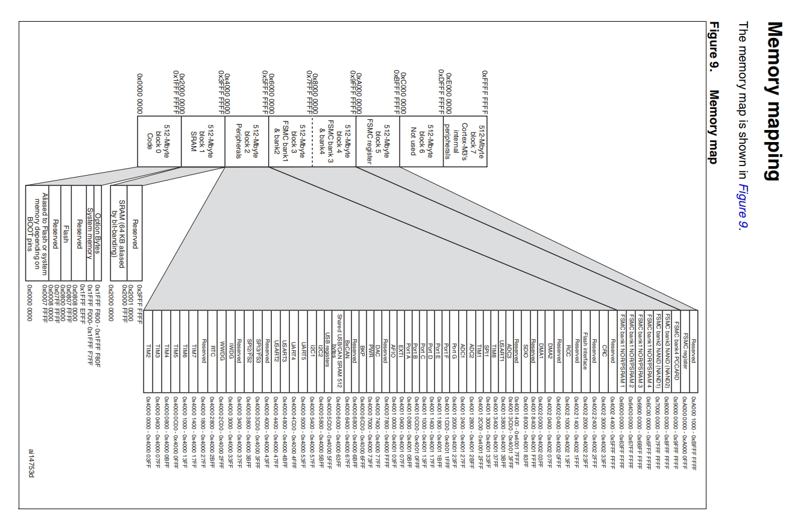

---
next:
  text: "我要成为点灯大师！"
  link: "./使用寄存器点亮第一个LED"

prev:
  text: "stm32最小系统"
  link: "./stm32最小系统"
---

# 存储器与寄存器



## 什么是寄存器和寄存器映射

我们把每个单元的功能作为名，给这个内存取一个别名，这个别名就是我们经常说的寄存器。然后通过 C 语言指针来操作这些寄存器即可。那什么是寄存器映射呢? 给已经分配好地址的有特定功能的内存单元取别名的过程就叫寄存器映射

也就是说寄存器就是有特定功能的内存单元

## 如何访问 STM32 寄存器内容

| 总线名称 | 总线基地址  | 相对外设基地址的偏移 |
| -------- | ----------- | -------------------- |
| APB1     | 0x4000 0000 | 0x0                  |
| APB2     | 0x4001 0000 | 0x0001 0000          |
| AHB      | 0x4001 8000 | 0x0001 8000          |

| 外设名称 | 外设基地址  | 相对 APB2 总线的地址偏移 |
| -------- | ----------- | ------------------------ |
| GPIOA    | 0x4001 0800 | 0x4001 0800              |
| GPIOB    | 0x4001 0C00 | 0x4001 0C00              |
| GPIOC    | 0x4001 1000 | 0x4001 1000              |
| GPIOD    | 0x4001 1400 | 0x4001 1400              |
| GPIOE    | 0x4001 1800 | 0x4001 1800              |
| GPIOF    | 0x4001 1C00 | 0x4001 1C00              |
| GPIOG    | 0x4001 2000 | 0x4001 2000              |

GPIO 占 4 字节 地址使用 16 进制

## 使用 C 语言封装寄存器

```c
//总线和外设基地址封装
#define PERIPH_BASE ((unsigned int)0x40000000)
#define APB2PERIPH_BASE (PERIPH_BASE + 0x00010000)
#define GPIOB_BASE (APB2PERIPH_BASE + 0x0C00)
#define GPIOB_CRL *(unsigned int*)(GPIOB_BASE+0x00)
#define GPIOB_CRH *(unsigned int*)(GPIOB_BASE+0x04)
#define GPIOB_IDR *(unsigned int*)(GPIOB_BASE+0x08)
#define GPIOB_ODR *(unsigned int*)(GPIOB_BASE+0x0C)
#define GPIOB_BSRR *(unsigned int*)(GPIOB_BASE+0x10)
#define GPIOB_BRR *(unsigned int*)(GPIOB_BASE+0x14)
#define GPIOB_LCKR *(unsigned int*)(GPIOB_BASE+0x18)
```

比如要控制 GPIOB5 输出一个低电平或者高电平：

```c
*(unsigned int *)GPIOB_BSRR = (0x01<<(16+5));
*(unsigned int *)GPIOB_BSRR = (0x01<<5);
```

比如要读取 GPIOB 管脚所有电平：

```c
unsigned int temp;
temp = *(unsigned int *)GPIOB_IDR;
```
